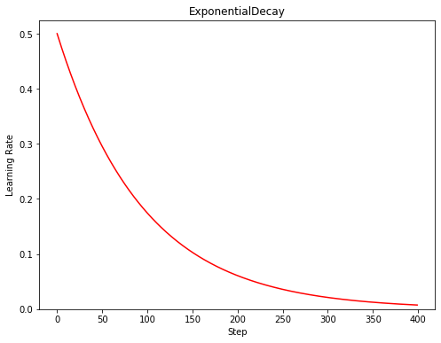

<center><b><font size=6 face='华文细黑'>TensorFlow学习笔记</font></b></center>


# 简介

本讲目标：学会神经网络优化过程，使用正则化减少过拟合，使用优化器更新网络参数。


# 1 神经网络复杂度

## 1.1 时间复杂度

即模型的运算次数，可用浮点运算次数（FPLOPs, FLoating-point OPerations）或者乘加运算次数衡量.

## 1.2 空间复杂度

空间复杂度（访存量），严格来讲包括两部分：总参数量 + 各层输出特征图。

- **参数量**：模型所有带参数的层的权重参数总量；
- **特征图**：模型在实时运行过程中每层所计算出的输出特征图大小。


# 2 学习率策略

## 2.1 指数衰减

​		<font size=4 color=red>**TensorFlow API:**  [tf.keras.optimizers.schedules.ExponentialDecay](#jump1) </font>


$$
decayed\_learning\_rate=learning\_rate\cdot decay\_rate^{(global\_step/decay\_steps)}
$$
​		其中，$learning\_rate$是初始学习率，$decay\_rate$是衰减率，$global\_step$表示从0到当前的训练次数，$decay\_steps$用来控制衰减速度。

​		指数衰减学习率是先使用较大的学习率来快速得到一个较优的解，然后随着迭代的继续,逐步减小学习率，使得模型在训练后期 更加稳定。指数型学习率衰减法是最常用的衰减方法，在大量模型中都广泛使用。

## 2.2 分段常数衰减

​		<font size=4 color=red>**TensorFlow API:**  [tf.optimizers.schedules.PiecewiseConstantDecay](#jump2) </font>


​		分段常数衰减可以让调试人员针对不同任务设置不同的学习率，进行**精细调参**，在任意步长后下降任意数值的learning rate，要求调试人员对模型和数据集有深刻认识.


# 3 激活函数

​		激活函数是用来加入非线性因素的，因为线性模型的表达能力不够。引入非线性激活函数，可使深层神经网络的表达能力更加强大。

​		优秀的激活函数应满足：

* **非线性：** 激活函数非线性时，多层神经网络可逼近所有函数

* **可微性：** 优化器大多用梯度下降更新参数

* **单调性：** 当激活函数是单调的，能保证单层网络的损失函数是凸函数

* **近似恒等性：** $f(x)\approx x$. 当参数初始化为随机小值时，神经网络更稳定

  激活函数输出值的范围：

* 激活函数输出为有限值时，基于梯度的优化方法更稳定

* 激活函数输出为无限值时，建议调小学习率

  常见的激活函数有：**sigmoid，tanh，ReLU，Leaky ReLU，PReLU，RReLU，ELU（Exponential Linear Units），softplus，softsign，softmax等**，下面介绍几个典型的激活函数：


## 3.1 sigmoid​

$$
f(x)=\frac{1}{1+e^{-x}}
$$


<center>函数图像</center>


<center>导数图像</center>

​		<font size=4 color=red>**TensorFlow API:**  [tf.math.sigmoid](#jump3) </font>

**<font size=4>优点</font>**：


1. 输出映射在(0,1)之间，单调连续，输出范围有限，优化稳定，可用作输出层；
2. 求导容易。

**<font size=4>缺点</font>**：

1. 易造成梯度消失；

2. 输出非0均值，收敛慢；

3. 幂运算复杂，训练时间长。

​        sigmoid函数可应用在训练过程中。然而，当处理分类问题作出输出时，sigmoid却无能为力。简单地说，sigmoid函数只能处理两个类，不适用于多分类问题。而softmax可以有效解决这个问题，并且softmax函数大都运用在神经网路中的最后一层网络中，使得值得区间在（0,1）之间，而不是二分类的。

## 3.2 tanh

$$
f(x)=\frac{1-e^{-2x}}{1+e^{-2x}}
$$


<center><font face='华文细黑'>函数图像</font></center>


<center><font face='华文细黑'>导数图像</font></center>

​		<font size=4 color=red>**TensorFlow API:**  [tf.math.tanh](#jump4) </font>

**<font size=4>优点</font>**：

1. <font face='华文细黑'>比sigmoid函数收敛速度更快。</font>
2. <font face='华文细黑'>相比sigmoid函数，其输出以0为中心。</font>

**<font size=4>缺点</font>**：

1. <font face='华文细黑'>易造成梯度消失；</font>
2. <font face='华文细黑'>幂运算复杂，训练时间长。</font>

## 3.3 ReLU

$$
f(x)=max(0, x)=
\begin{cases}
0 &x<0\\
x &x\ge0
\end{cases}
$$


<center><font face='华文细黑'>函数图像</font></center>


<center><font face='华文细黑'>导数图像</font></center>

​		<font size=4 color=red>**TensorFlow API:**  [tf.nn.relu](#jump5) </font>

**<font size=4>优点</font>**：

1. <font face='华文细黑'>解决了梯度消失问题(在正区间)；</font>
2. <font face='华文细黑'>只需判断输入是否大于0，计算速度快；</font>
3. <font face='华文细黑'>收敛速度远快于sigmoid和tanh，因为sigmoid和tanh涉及很多expensive的操作；</font>
4. <font face='华文细黑'>提供了神经网络的稀疏表达能力。</font>

**<font size=4>缺点</font>**：

1. <font face='华文细黑'>输出非0均值，收敛慢；</font>
2. <font face='华文细黑'>Dead ReLU问题：某些神经元可能永远不会被激活，导致相应的参数永远不能被更新。</font>

## 3.4 Leaky ReLU

$$
f(x)=max(\alpha x, x)
$$


<center><font face='华文细黑'>函数图像</font></center>


<center><font face='华文细黑'>导数图像</font></center>

​		<font size=4 color=red>**TensorFlow API:**  [tf.nn.leaky_relu](#jump6) </font>

​		<font face='华文细黑'>理论上来讲，Leaky ReLU有ReLU的所有优点，外加不会有Dead ReLU问题，但是在实际操作当中，并没有完全证明Leaky ReLU总是好于ReLU。</font>

## 3.5 softmax

$$
\sigma(\boldsymbol z)_j= \frac{e^{z_j}}{\sum_{k=1}^{K}e^{z_k}}\;\; \;for\;j=1,\dots,K
$$

​		<font size=4 color=red>**TensorFlow API:**  [tf.nn.softmax](#jump7) </font>

​		<font face='华文细黑'>对神经网络全连接层输出进行变换，使其服从概率分布，即每个值都位于[0,1]区间且和为1。</font>

## 3.6 建议

<font face='华文细黑'>**对于初学者的建议：**</font>

1. <font face='华文细黑'>首选ReLU激活函数；</font>
2. <font face='华文细黑'>学习率设置较小值；</font>
3. <font face='华文细黑'>输入特征标准化，即让输入特征满足以0为均值，1为标准差的正态分布；</font>
4. <font face='华文细黑'>初始化问题：初始参数中心化，即让随机生成的参数满足以0为均值，</font> $\sqrt{\frac{2}{当前层输入特征个数}}$<font face='华文细黑'>为标准差的正态分布。</font>

# 4 损失函数

​		<font face='华文细黑'>神经网络模型的效果及优化的目标是通过损失函数来定义的。回归和分类是监督学习中的两个大类。</font>

## 4.1 均方误差损失函数

​		<font face='华文细黑'>均方误差（Mean Square Error）是回归问题最常用的损失函数。回归问题解决的是对具体数值的预测，比如房价预测、销量预测等。这些问题需要预测的不是一个事先定义好的类别，而是一个任意实数。均方误差定义如下：</font>
$$
MSE(y,y^{'})=\frac{\Sigma_{i=1}^n(y_i-y^{'}_i)^2}{n}
$$
​		<font face='华文细黑'>其中</font> $y_i$ <font face='华文细黑'>为一个batch中第i个数据的真实值，而</font> $y_i^{'}$ <font face='华文细黑'>为神经网络的预测值。</font>

​		<font size=4 color=red>**TensorFlow API:**  [tf.keras.losses.MSE](#jump8) </font>

## 4.2 交叉熵损失函数

​		<font face='华文细黑'>交叉熵（Cross Entropy）表征两个概率分布之间的距离，交叉熵越小说明二者分布越接近，是分类问题中使用较广泛的损失函数。 </font>
$$
H(y\_, y)=-\Sigma y\_*lny
$$
​		<font face='华文细黑'>其中</font> $y\_$ <font face='华文细黑'>代表数据的真实值，</font>$y$ <font face='华文细黑'>代表神经网络的预测值。</font>

​		<font face='华文细黑'>对于多分类问题，神经网络的输出一般不是概率分布，因此需要引入softmax层，使得输出服从概率分布。TensorFlow中可计算交叉熵损失函数的API有：</font>

​		<font size=4 color=red>**TensorFlow API:**  [tf.keras.losses.categorical_crossentropy](#jump9) </font>

​		<font size=4 color=red>**TensorFlow API:**  [tf.nn.softmax_cross_entropy_with_logits](#jump10) </font>

​		<font size=4 color=red>**TensorFlow API:**  [tf.nn.sparse_softmax_cross_entropy_with_logits](#jump11) </font>

## 4.3 自定义损失函数

​		<font face='华文细黑'>根据具体任务和目的，可设计不同的损失函数。从老师课件和讲解中对于酸奶预测损失函数的设计，我们可以得知损失函数的定义能极大影响模型预测效果。好的损失函数设计对于模型训练能够起到良好的引导作用。</font>

​		<font face='华文细黑'>例如，我们可以看目标检测中的多种损失函数。目标检测的主要功能是定位和识别，损失函数的功能主要就是让定位更精确，识别准确率更高。目标检测任务的损失函数由分类损失（Classificition Loss）和回归损失（Bounding Box Regeression Loss）两部分构成。近几年来回归损失主要有Smooth L1 Loss(2015), IoU Loss(2016 ACM), GIoU Loss(2019 CVPR), DIoU Loss & CIoU Loss(2020 AAAI)等，分类损失有交叉熵、softmax loss、logloss、focal loss等。在此由于篇幅原因不细究，有兴趣的同学可自行研究。主要是给大家一个感性的认知：需要针对特定的背景、具体的任务设计损失函数。</font>

# 5 欠拟合与过拟合

<font face='华文细黑'>**欠拟合的解决方法：**</font>

* <font face='华文细黑'>增加输入特征项</font>

* <font face='华文细黑'>增加网络参数</font>

* <font face='华文细黑'>减少正则化参数</font>

<font face='华文细黑'>**过拟合的解决方法：**</font>

* <font face='华文细黑'>数据清洗</font>

* <font face='华文细黑'>增大训练集</font>

* <font face='华文细黑'>采用正则化</font>

* <font face='华文细黑'>增大正则化参数</font>

# 6 优化器

​		<font face='华文细黑'>优化算法可以分成一阶优化和二阶优化算法，其中一阶优化就是指的梯度算法及其变种，而二阶优化一般是用二阶导数（Hessian 矩阵）来计算，如牛顿法，由于需要计算Hessian阵和其逆矩阵，计算量较大，因此没有流行开来。这里主要总结一阶优化的各种梯度下降方法。</font>

​		<font face='华文细黑'>深度学习优化算法经历了SGD -> SGDM -> NAG ->AdaGrad -> AdaDelta -> Adam -> Nadam 这样的发展历程。</font>

> 定义：待优化参数 $\omega$，损失函数 $f(\omega)$，初始学习率 $\alpha$，每次迭代一个batch，t表示当前batch迭代的总次数。
>
> 1. 计算损失函数关于当前参数的梯度：$g_t=\nabla f(\omega_t)=\frac{\partial f}{\partial \omega _t}$
> 2. 根据历史梯度计算**一阶动量**和**二阶动量**：$m_t=\phi(g_1,g_2,...,g_t)\;,\;V_t=\psi(g_1,g_2,...,g_t)$
> 3. 计算当前时刻的下降梯度：$\eta_t=\alpha\cdot m_t/\sqrt{V_t}$
> 4. 根据下降梯度进行更新：$\omega_{t+1}=\omega_t-\eta_t$
>
> 步骤3，4对于各算法都是一致的，主要差别体现在步骤1和2上。

## 6.1 SGD

​		<font size=4 color=red>**TensorFlow API:**  [tf.keras.optimizers.SGD](https://www.tensorflow.org/api_docs/python/tf/keras/optimizers/SGD) </font>

### 6.1.1 vanilla SGD

​		<font face='华文细黑'>最初版本的SGD没有动量的概念，</font>
$$
m_t=g_t\;,\;V_t=1
$$
​		<font face='华文细黑'>梯度下降是最简单的：</font>
$$
\eta_t=\alpha\cdot g_t
$$
​		<font face='华文细黑'>vanilla SGD最大的缺点是下降速度慢，而且可能会在沟壑的两边持续震荡，停留在一个局部最优点。</font>

​		<font face='华文细黑'>代码实现：</font>

```python
 # sgd
 w1.assign_sub(learning_rate * grads[0])
 b1.assign_sub(learning_rate * grads[1])
```


### 6.1.2 SGD with Momentum

​		<font face='华文细黑'>动量法是一种使**梯度向量**向相关方向加速变化，抑制震荡，最终实现加速收敛的方法。([**Momentum**](https://www.sciencedirect.com/science/article/pii/S0893608098001166?via%3Dihub) is a method that helps accelerate SGD in the right direction and dampens oscillations. It adds a fraction</font> $\beta $  <font face='华文细黑'>of the update vector of the past time step to the current update vector. The momentum term increases for dimensions whose gradients point in the same directions and reduces updates for dimensions whose gradients change directions.)</font>

​		<font face='华文细黑'>为了抑制SGD的震荡，SGDM认为梯度下降过程可以加入惯性。下坡的时候，如果发现是陡坡，那就利用惯性跑的快一些。SGDM全称是SGD with Momentum，在SGD基础上引入了一阶动量：</font>
$$
m_t=\beta_1\cdot m_{t-1}+(1-\beta_1)\cdot g_t
$$
​		<font face='华文细黑'>一阶动量是各个时刻梯度方向的指数移动平均值，约等于最近</font>$1/(1-\beta_1)$ <font face='华文细黑'>个时刻的梯度向量和的平均值。也就是说，t 时刻的下降方向，不仅由当前点的梯度方向决定，而且由此前累积的下降方向决定。</font>$\beta_1$ <font face='华文细黑'>的经验值为0.9，这就意味着下降方向主要偏向此前累积的下降方向，并略微偏向当前时刻的下降方向。</font>


​		<font face='华文细黑'>代码实现：</font>

```python
# sgd-momentun
beta = 0.9
m_w = beta * m_w + (1 - beta) * grads[0]
m_b = beta * m_b + (1 - beta) * grads[1]
w1.assign_sub(learning_rate * m_w)
b1.assign_sub(learning_rate * m_b)
```


### 6.1.3 SGD with Nesterov Acceleration

​		<font face='华文细黑'>SGD 还有一个问题是会被困在一个局部最优点里。就像被一个小盆地周围的矮山挡住了视野，看不到更远的更深的沟壑。</font>

​		<font face='华文细黑'>NAG全称Nesterov Accelerated Gradient，是在SGD、SGDM的基础上的进一步改进，改进点在于步骤1。我们知道在时刻t的主要下降方向是由累积动量决定的，自己的梯度方向说了也不算，那与其看当前梯度方向，不如先看看如果跟着累积动量走了一步，那个时候再怎么走。因此，NAG在步骤1不计算当前位置的梯度方向，而是计算如果按照累积动量走了一步，考虑这个新地方的梯度方向。此时的梯度就变成了：</font>
$$
g_t=\nabla f(\omega_t-\alpha\cdot m_{t-1})
$$
​		<font face='华文细黑'>我们用这个梯度带入 SGDM 中计算</font>  $m_t$ <font face='华文细黑'>的式子里去，然后再计算当前时刻应有的梯度并更新这一次的参数。</font>

​		<font face='华文细黑'>其基本思路如下图（转自[Hinton的Lecture slides](http://www.cs.toronto.edu/~tijmen/csc321/slides/lecture_slides_lec6.pdf)）：</font>


​		<font face='华文细黑'>首先，按照原来的更新方向更新一步（棕色线），然后计算该新位置的梯度方向（红色线），然后用这个梯度方向修正最终的更新方向（绿色线）。上图中描述了两步的更新示意图，其中蓝色线是标准momentum更新路径。</font>


## 6.2 AdaGrad

​		<font size=4 color=red>**TensorFlow API:**  [tf.keras.optimizers.Adagrad](https://www.tensorflow.org/api_docs/python/tf/keras/optimizers/Adagrad) </font>

​		<font face='华文细黑'>上述SGD算法一直存在一个超参数（Hyper-parameter），即学习率。超参数是训练前需要手动选择的参数，前缀“hyper”就是用于区别训练过程中可自动更新的参数。学习率可以理解为参数</font> $\omega$ <font face='华文细黑'>沿着梯度</font> $g$ <font face='华文细黑'>反方向变化的步长。</font>

​		<font face='华文细黑'>SGD对所有的参数使用统一的、固定的学习率，一个自然的想法是对每个参数设置不同的学习率，然而在大型网络中这是不切实际的。因此，为解决此问题，AdaGrad算法被提出，其做法是给学习率一个缩放比例，从而达到了自适应学习率的效果（Ada = Adaptive）。其思想是：对于频繁更新的参数，不希望被单个样本影响太大，我们给它们很小的学习率；对于偶尔出现的参数，希望能多得到一些信息，我们给它较大的学习率。</font>

​		<font face='华文细黑'>那怎么样度量历史更新频率呢？为此引入二阶动量——该维度上，所有梯度值的平方和：</font>
$$
V_t=\sum_{\tau=1}^tg_\tau^2
$$
​		<font face='华文细黑'>回顾步骤 3 中的下降梯度：</font>$\eta_t=\alpha\cdot m_t/\sqrt{V_t}$ <font face='华文细黑'>可视为</font> $\eta_t={\frac{\alpha}{\sqrt{V_t}}\cdot m_t}$ ，<font face='华文细黑'>即对学习率进行缩放。（一般为了防止分母为 0 ，会对二阶动量加一个平滑项，即</font>$\eta_t=\alpha\cdot m_t/\sqrt{V_t+\varepsilon}$，$\varepsilon$<font face='华文细黑'>是一个非常小的数。）</font>

​		<font face='华文细黑'>AdaGrad 在稀疏数据场景下表现最好。因为对于频繁出现的参数，学习率衰减得快；对于稀疏的参数，学习率衰减得更慢。然而在实际很多情况下，二阶动量呈单调递增，累计从训练开始的梯度，学习率会很快减至 0 ，导致参数不再更新，训练过程提前结束。</font>

​		<font face='华文细黑'>代码实现：</font>

```python
 # adagrad
v_w += tf.square(grads[0])
v_b += tf.square(grads[1])
w1.assign_sub(learning_rate * grads[0] / tf.sqrt(v_w))
b1.assign_sub(learning_rate * grads[1] / tf.sqrt(v_b))
```


## 6.3 RMSProp

​		<font size=4 color=red>**TensorFlow API:**  [tf.keras.optimizers.RMSprop](https://www.tensorflow.org/api_docs/python/tf/keras/optimizers/RMSprop) </font>

​		<font face='华文细黑'>RMSProp算法的全称叫 Root Mean Square Prop，是由Geoffrey E. Hinton提出的一种优化算法（Hinton的课件见下图）。由于 AdaGrad 的学习率衰减太过激进，考虑改变二阶动量的计算策略：不累计全部梯度，只关注过去某一窗口内的梯度。修改的思路很直接，前面我们说过，指数移动平均值大约是过去一段时间的平均值，反映“局部的”参数信息，因此我们用这个方法来计算二阶累积动量：</font>

$$
m_t=g_t\qquad V_t=\beta_2\cdot V_{t-1}+(1-\beta_2)\cdot g_t^2\\
\eta _t=\frac{\alpha}{\sqrt{V_t}}\cdot m_t=\frac{\alpha}{\sqrt{\beta_2\cdot V_{t-1}+(1-\beta_2)\cdot g_t^2}}\cdot g_t\\
\omega_{t+1}=\omega_t-\eta_t
$$

​		<font face='华文细黑'>下图是来自Hinton的Lecture：</font>


​		<font face='华文细黑'>代码实现：</font>

```python
# RMSProp
beta = 0.9
v_w = beta * v_w + (1 - beta) * tf.square(grads[0])
v_b = beta * v_b + (1 - beta) * tf.square(grads[1])
w1.assign_sub(learning_rate * grads[0] / tf.sqrt(v_w))
b1.assign_sub(learning_rate * grads[1] / tf.sqrt(v_b))
```


## 6.4 AdaDelta

​		<font size=4 color=red>**TensorFlow API:**  [tf.keras.optimizers.Adadelta](https://www.tensorflow.org/api_docs/python/tf/keras/optimizers/Adadelta) </font>

​		<font face='华文细黑'>为解决AdaGrad的学习率递减太快的问题，RMSProp和AdaDelta几乎同时独立被提出。</font>

​		<font face='华文细黑'>我们先看论文的AdaDelta算法，下图来自[原论文](#jump1)：</font>


​		<font face='华文细黑'>对于上图算法的一点解释，</font> $RMS[g]_t$ <font face='华文细黑'>是梯度</font> $g$ <font face='华文细黑'>的均方根（Root Mean Square），</font>$RMS[\Delta x]_{t-1}$ <font face='华文细黑'>是</font> $\Delta x$ <font face='华文细黑'>的均方根：</font>
$$
RMS[g]_t=\sqrt {E[g^2]_t}\\
RMS[\Delta x]_{t-1}=\sqrt {E[\Delta x^2]_{t-1}}
$$
​		<font face='华文细黑'>我们可以看到AdaDelta与RMSprop仅仅是分子项不同，为了与前面公式保持一致，在此用</font> $\sqrt{U_t}$ <font face='华文细黑'>表示</font> $\eta$ <font face='华文细黑'>的均方根：</font>
$$
m_t=g_t\qquad V_t=\beta_2\cdot V_{t-1}+(1-\beta_2)\cdot g_t^2\\
\eta _t=\frac{\sqrt{U_{t-1}}}{\sqrt{V_t}}\cdot m_t=\frac{\sqrt{U_{t-1}}}{\sqrt{\beta_2\cdot V_{t-1}+(1-\beta_2)\cdot g_t^2}}\cdot g_t\\
U_t=\beta _2\cdot U_{t-1}+(1-\beta_2)\cdot \eta_t^2\\
\omega_{t+1}=\omega_t-\eta_t
$$

​		<font face='华文细黑'>代码实现：</font>

```python
 # AdaDelta
 beta = 0.999
 v_w = beta * v_w + (1 - beta) * tf.square(grads[0])
 v_b = beta * v_b + (1 - beta) * tf.square(grads[1])

 delta_w = tf.sqrt(u_w) * grads[0] / tf.sqrt(v_w)
 delta_b = tf.sqrt(u_b) * grads[1] / tf.sqrt(v_b)

 u_w = beta * u_w + (1 - beta) * tf.square(delta_w)
 u_b = beta * u_b + (1 - beta) * tf.square(delta_b)

 w1.assign_sub(delta_w)
 b1.assign_sub(delta_b)
```


## 6.5 Adam

​		<font size=4 color=red>**TensorFlow API:**  [tf.keras.optimizers.Adam](https://www.tensorflow.org/api_docs/python/tf/keras/optimizers/Adam)</font>

​		<font face='华文细黑'>Adam名字来源是adaptive moment estimation。Our method is designed to combine the advantages of two recently popular methods: AdaGrad (Duchi et al., 2011), which works well with sparse gradients, and RMSProp (Tieleman & Hinton, 2012), which works well in on-line and non-stationary settings。也就是说，adam融合了Adagrad和RMSprop的思想。</font>


​		<font face='华文细黑'>谈到这里，Adam的出现就很自然而然了——它们是前述方法的集大成者。我们看到，SGDM在SGD基础上增加了一阶动量，AdaGrad、RMSProp和AdaDelta在SGD基础上增加了二阶动量。把一阶动量和二阶动量结合起来，再修正偏差，就是Adam了。</font>

​		<font face='华文细黑'>SGDM的一阶动量：</font>
$$
m_t=\beta_1\cdot m_{t-1}+(1-\beta_1)\cdot g_t
$$
​		<font face='华文细黑'>加上RMSProp的二阶动量：</font>
$$
V_t=\beta_2\cdot V_{t-1}+(1-\beta_2)\cdot g_t^2
$$
​		<font face='华文细黑'>其中，参数经验值是</font> $\beta _1=0.9,\beta _2=0.999$ 。

​		<font face='华文细黑'>一阶动量和二阶动量都是按照指数移动平均值进行计算的。初始化</font> $m_0=0,V_0=0$ ，<font face='华文细黑'>在初期，迭代得到的</font> $m_t,V_t$ <font face='华文细黑'>会接近于0。我们可以通过对</font> $m_t,V_t$ <font face='华文细黑'>进行偏差修正来解决这一问题：</font>
$$
\hat{m_t}=\frac{m_t}{1-\beta_1^t}\\
\hat{V_t}=\frac{V_t}{1-\beta_2^t}
$$

​		<font face='华文细黑'>代码实现：</font>

```python
# adam
m_w = beta1 * m_w + (1 - beta1) * grads[0]
m_b = beta1 * m_b + (1 - beta1) * grads[1]
v_w = beta2 * v_w + (1 - beta2) * tf.square(grads[0])
v_b = beta2 * v_b + (1 - beta2) * tf.square(grads[1])

m_w_correction = m_w / (1 - tf.pow(beta1, int(global_step)))
m_b_correction = m_b / (1 - tf.pow(beta1, int(global_step)))
v_w_correction = v_w / (1 - tf.pow(beta2, int(global_step)))
v_b_correction = v_b / (1 - tf.pow(beta2, int(global_step)))

w1.assign_sub(learning_rate * m_w_correction / tf.sqrt(v_w_correction))
b1.assign_sub(learning_rate * m_b_correction / tf.sqrt(v_b_correction))
```


<font size=4>**各优化器来源：**</font>

* <font face='华文细黑'>SGD（1952）：https://projecteuclid.org/euclid.aoms/1177729392（源自[回答](https://stats.stackexchange.com/questions/313681/who-invented-stochastic-gradient-descent)）</font>

* <font face='华文细黑'>SGD with Momentum（1999）：https://www.sciencedirect.com/science/article/abs/pii/S0893608098001166</font>

* <font face='华文细黑'>SGD with Nesterov Acceleration（1983）：由[Yurii Nesterov](https://en.wikipedia.org/wiki/Yurii_Nesterov)提出</font>

* <font face='华文细黑'>AdaGrad（2011）: http://www.jmlr.org/papers/volume12/duchi11a/duchi11a.pdf</font>

* <font face='华文细黑'>RMSProp（2012）: http://www.cs.toronto.edu/~tijmen/csc321/slides/lecture_slides_lec6.pdf</font>

* <font face='华文细黑'>AdaDelta（2012）: https://arxiv.org/abs/1212.5701 <a name="jump1"></a></font>

* <font face='华文细黑'>Adam:（2014） https://arxiv.org/abs/1412.6980</font>

<font face='华文细黑'>（对上述算法非常好的可视化：https://imgur.com/a/Hqolp）</font>

## 6.5 优化器选择

​		<font face='华文细黑'>很难说某一个优化器在所有情况下都表现很好，我们需要根据具体任务选取优化器。一些优化器在计算机视觉任务表现很好，另一些在涉及RNN网络时表现很好，甚至在稀疏数据情况下表现更出色。</font>

​		<font face='华文细黑'>总结上述，基于原始SGD增加动量和Nesterov动量，RMSProp是针对AdaGrad学习率衰减过快的改进，它与AdaDelta非常相似，不同的一点在于AdaDelta采用参数更新的均方根（RMS）作为分子。Adam在RMSProp的基础上增加动量和偏差修正。如果数据是稀疏的，建议用自适用方法，即 Adagrad, RMSprop, Adadelta, Adam。RMSprop, Adadelta, Adam 在很多情况下的效果是相似的。随着梯度变的稀疏，Adam 比 RMSprop 效果会好。总的来说，Adam整体上是最好的选择。</font>

​		<font face='华文细黑'>然而很多论文仅使用不带动量的vanilla SGD和简单的学习率衰减策略。SGD通常能够达到最小点，但是相对于其他优化器可能要采用更长的时间。采取合适的初始化方法和学习率策略，SGD更加可靠，但也有可能陷于鞍点和极小值点。因此，当在训练大型的、复杂的深度神经网络时，我们想要快速收敛，应采用自适应学习率策略的优化器。</font>

​		<font face='华文细黑'>如果是刚入门，优先考虑Adam或者SGD+Nesterov Momentum。</font>

​		<font face='华文细黑'>算法没有好坏，最适合数据的才是最好的，永远记住：No free lunch theorem。</font>

## 6.6 优化算法的常用tricks


<font face='华文细黑'>最后，分享一些在优化算法的选择和使用方面的一些tricks。</font>


1. <font face='华文细黑'>**首先，各大算法孰优孰劣并无定论。**如果是刚入门，优先考虑**SGD+Nesterov Momentum**或者**Adam.**（[Standford 231n](https://link.zhihu.com/?target=http%3A//cs231n.github.io/neural-networks-3/) : *The two recommended updates to use are either SGD+Nesterov Momentum or Adam*）</font>
2. <font face='华文细黑'>**选择你熟悉的算法**——这样你可以更加熟练地利用你的经验进行调参。</font>
3. <font face='华文细黑'>**充分了解你的数据**——如果模型是非常稀疏的，那么优先考虑自适应学习率的算法。</font>
4. <font face='华文细黑'>**根据你的需求来选择**——在模型设计实验过程中，要快速验证新模型的效果，可以先用Adam进行快速实验优化；在模型上线或者结果发布前，可以用精调的SGD进行模型的极致优化。</font>
5. <font face='华文细黑'>**先用小数据集进行实验。**有论文研究指出，随机梯度下降算法的收敛速度和数据集的大小的关系不大。（*The mathematics of stochastic gradient descent are amazingly independent of the training set size. In particular, the asymptotic SGD convergence rates are independent from the sample size.*）因此可以先用一个具有代表性的小数据集进行实验，测试一下最好的优化算法，并通过参数搜索来寻找最优的训练参数。</font>
6. <font face='华文细黑'>**考虑不同算法的组合。**先用Adam进行快速下降，而后再换到SGD进行充分的调优。</font>
7. <font face='华文细黑'>**充分打乱数据集（shuffle）。**这样在使用自适应学习率算法的时候，可以避免某些特征集中出现，而导致的有时学习过度、有时学习不足，使得下降方向出现偏差的问题。在每一轮迭代后对训练数据打乱是一个不错的主意。</font>
8. <font face='华文细黑'>训练过程中**持续监控训练数据和验证数据**上的目标函数值以及精度或者AUC等指标的变化情况。对训练数据的监控是要保证模型进行了充分的训练——下降方向正确，且学习率足够高；对验证数据的监控是为了避免出现过拟合。</font>
9. <font face='华文细黑'>**制定一个合适的学习率衰减策略。**可以使用分段常数衰减策略，比如每过多少个epoch就衰减一次；或者利用精度或者AUC等性能指标来监控，当测试集上的指标不变或者下跌时，就降低学习率。</font>
10. <font face='华文细黑'>**Early stopping**。如Geoff Hinton所说：“Early Stopping是美好的免费午餐”。你因此必须在训练的过程中时常在验证集上监测误差，在验证集上如果损失函数不再显著地降低，那么应该提前结束训练。</font>
11. <font face='华文细黑'>**算法参数的初始值选择。** 初始值不同，获得的最小值也有可能不同，因此梯度下降求得的只是局部最小值；当然如果损失函数是凸函数则一定是最优解。由于有局部最优解的风险，需要多次用不同初始值运行算法，关键损失函数的最小值，选择损失函数最小化的初值。</font>

# 参考链接

1. [TensorFlow官网](https://www.tensorflow.org)
2. [卷积神经网络的复杂度分析](https://zhuanlan.zhihu.com/p/31575074)
3. [一个框架看懂优化算法之异同 SGD/AdaGrad/Adam](https://zhuanlan.zhihu.com/p/32230623?utm_source=wechat_session&utm_medium=social&utm_oi=665198710112391168)
4. [梯度下降法家族](http://sakigami-yang.me/2017/12/23/GD-Series/)
5. [Some State of the Art Optimizers in Neural Networks](https://hackernoon.com/some-state-of-the-art-optimizers-in-neural-networks-a3c2ba5a5643)
6. [An overview of gradient descent optimization algorithms](https://arxiv.org/abs/1609.04747)

# 附录：常用TensorFlow API及代码实现

## 学习率策略

### tf.keras.optimizers.schedules.ExponentialDecay<a name="jump1"></a>

```python
tf.keras.optimizers.schedules.ExponentialDecay(
    initial_learning_rate, decay_steps, decay_rate, staircase=False, name=None
)
```

**功能：**<font size=3>指数衰减学习率策略.</font>
**等价API：**tf.optimizers.schedules.ExponentialDecay
**参数：**

+ <mark style=background-color:#DCDCDC>initial_learning_rate</mark>: 初始学习率.
+ <mark style=background-color:#DCDCDC>decay_steps</mark>: 衰减步数, <mark style=background-color:#DCDCDC>staircase</mark>为True时有效.
+ <mark style=background-color:#DCDCDC>decay_rate</mark>: 衰减率.
+ <mark style=background-color:#DCDCDC>staircase</mark>: Bool型变量.如果为True, 学习率呈现阶梯型下降趋势.

**返回：**<mark style=background-color:#DCDCDC>tf.keras.optimizers.schedules.ExponentialDecay(step)</mark>返回计算得到的学习率.
**链接：** [tf.keras.optimizers.schedules.ExponentialDecay](https://www.tensorflow.org/api_docs/python/tf/keras/optimizers/schedules/ExponentialDecay)
**例子：**


```python
N = 400
lr_schedule = tf.keras.optimizers.schedules.ExponentialDecay(
    0.5,
    decay_steps=10,
    decay_rate=0.9,
    staircase=False)
y = []
for global_step in range(N):
    lr = lr_schedule(global_step)
    y.append(lr)
x = range(N)
plt.figure(figsize=(8,6))
plt.plot(x, y, 'r-')
plt.ylim([0,max(plt.ylim())])
plt.xlabel('Step')
plt.ylabel('Learning Rate')
plt.title('ExponentialDecay')
plt.show()
```


### tf.keras.optimizers.schedules.PiecewiseConstantDecay<a name="jump2"></a>

```python
tf.keras.optimizers.schedules.PiecewiseConstantDecay(
    boundaries, values, name=None
)
```

**功能：**<font size=3>分段常数衰减学习率策略.</font>
**等价API：**tf.optimizers.schedules.PiecewiseConstantDecay
**参数：**

+ <mark style=background-color:#DCDCDC>boundaries</mark>: [step_1, step_2, ..., step_n]定义了在第几步进行学习率衰减.
+ <mark style=background-color:#DCDCDC>values</mark>: [val_0, val_1, val_2, ..., val_n]定义了学习率的初始值和后续衰减时的具体取值.

**返回：**<mark style=background-color:#DCDCDC>tf.keras.optimizers.schedules.PiecewiseConstantDecay(step)</mark>返回计算得到的学习率.
**链接：** [tf.keras.optimizers.schedules.PiecewiseConstantDecay](https://www.tensorflow.org/api_docs/python/tf/keras/optimizers/schedules/PiecewiseConstantDecay)
**例子：**


```python
N = 400
lr_schedule = tf.keras.optimizers.schedules.PiecewiseConstantDecay(
    boundaries=[100, 200, 300],
    values=[0.1, 0.05, 0.025, 0.001])
y = []
for global_step in range(N):
    lr = lr_schedule(global_step)
    y.append(lr)
x = range(N)
plt.figure(figsize=(8,6))
plt.plot(x, y, 'r-')
plt.ylim([0,max(plt.ylim())])
plt.xlabel('Step')
plt.ylabel('Learning Rate')
plt.title('PiecewiseConstantDecay')
plt.show()
```


## 激活函数

### tf.math.sigmoid<a name="jump3"></a>

```python
tf.math.sigmoid(
    x, name=None
)
```

**功能：**<font size=3>计算x每一个元素的sigmoid值.</font>
**等价API：**tf.nn.sigmoid, tf.sigmoid
**参数：**

+ <mark style=background-color:#DCDCDC>x</mark>: 张量x.

**返回：**与<mark style=background-color:#DCDCDC>x</mark> shape相同的张量.
**链接：** [tf.math.sigmoid](https://www.tensorflow.org/api_docs/python/tf/math/sigmoid)
**例子：**


```python
x = tf.constant([1., 2., 3.], )
print(tf.math.sigmoid(x))
```

    >>> tf.Tensor([0.7310586  0.880797   0.95257413], shape=(3,), dtype=float32)

```python
# 等价实现
print(1/(1+tf.math.exp(-x)))
```

    >>> tf.Tensor([0.7310586  0.880797   0.95257413], shape=(3,), dtype=float32)

### tf.math.tanh<a name="jump4"></a>

```python
tf.math.tanh(
    x, name=None
)
```

**功能：**<font size=3>计算x每一个元素的双曲正切值.</font>
**等价API：**tf.nn.tanh, tf.tanh
**参数：**

+ <mark style=background-color:#DCDCDC>x</mark>: 张量x.

**返回：**与<mark style=background-color:#DCDCDC>x</mark> shape相同的张量.
**链接：** [tf.math.tanh](https://www.tensorflow.org/api_docs/python/tf/math/tanh)
**例子：**


```python
x = tf.constant([-float("inf"), -5, -0.5, 1, 1.2, 2, 3, float("inf")])
print(tf.math.tanh(x))
```

    >>> tf.Tensor([-1. -0.99990916 -0.46211717 0.7615942 0.8336547 0.9640276 0.9950547 1.], shape=(8,), dtype=float32)

```python
# 等价实现
print((tf.math.exp(x)-tf.math.exp(-x))/(tf.math.exp(x)+tf.math.exp(-x)))
```

    >>> tf.Tensor([nan -0.9999091 -0.46211714 0.7615942 0.83365464 0.9640275 0.9950547 nan], shape=(8,), dtype=float32)

### tf.nn.relu<a name="jump5"></a>

```python
tf.nn.relu(
    features, name=None
)
```

**功能：**<font size=3>计算修正线性值(rectified linear)：<mark style=background-color:#DCDCDC>max(features, 0)</mark>.</font>
**参数：**

+ <mark style=background-color:#DCDCDC>features</mark>: 张量.

**返回：**与<mark style=background-color:#DCDCDC>features</mark> shape相同的张量.
**链接：** [tf.nn.relu](https://www.tensorflow.org/api_docs/python/tf/nn/relu)
**例子：**


```python
print(tf.nn.relu([-2., 0., -0., 3.]))
```

    >>> z

### tf.nn.leaky_relu<a name="jump6"></a>

```python
tf.nn.leaky_relu(
    features, alpha=0.2, name=None
)
```

**功能：**<font size=3>计算Leaky ReLU值.</font>
**参数：**

+ <mark style=background-color:#DCDCDC>features</mark>: 张量.
+ <mark style=background-color:#DCDCDC>alpha</mark>: x<0时的斜率值.

**返回：**与<mark style=background-color:#DCDCDC>features</mark> shape相同的张量.
**链接：** [tf.nn.leaky_relu](https://www.tensorflow.org/api_docs/python/tf/nn/leaky_relu)
**例子：**


```python
print(tf.nn.leaky_relu([-2., 0., -0., 3.]))
```

    >>> tf.Tensor([-0.4 0. -0. 3.], shape=(4,), dtype=float32)

### tf.nn.softmax<a name="jump7"></a>

```python
tf.nn.softmax(
    logits, axis=None, name=None
)
```

**功能：**<font size=3>计算softmax激活值.</font>
**等价API：**tf.math.softmax
**参数：**

+ <mark style=background-color:#DCDCDC>logits</mark>: 张量.
+ <mark style=background-color:#DCDCDC>axis</mark>: 计算softmax所在的维度. 默认为-1，即最后一个维度.

**返回：**与<mark style=background-color:#DCDCDC>logits</mark> shape相同的张量.
**链接：** [tf.nn.softmax](https://www.tensorflow.org/api_docs/python/tf/nn/softmax)
**例子：**


```python
logits = tf.constant([4., 5., 1.])
print(tf.nn.softmax(logits))
```

    >>> tf.Tensor([0.26538792 0.7213992 0.01321289], shape=(3,), dtype=float32)

```python
# 等价实现
print(tf.exp(logits) / tf.reduce_sum(tf.exp(logits)))
```

    >>> tf.Tensor([0.26538792 0.72139925 0.01321289], shape=(3,), dtype=float32)

## 损失函数

### tf.keras.losses.MSE<a name="jump8"></a>

```python
tf.keras.losses.MSE(
    y_true, y_pred
)
```

**功能：**<font size=3>计算<mark style=background-color:#DCDCDC>y_true</mark>和<mark style=background-color:#DCDCDC>y_pred</mark></font>的均方误差.  
**链接：** [tf.keras.losses.MSE](https://www.tensorflow.org/api_docs/python/tf/keras/losses/MSE)  
**例子：**


```python
y_true = tf.constant([0.5, 0.8])
y_pred = tf.constant([1.0, 1.0])
print(tf.keras.losses.MSE(y_true, y_pred))
```

    >>> tf.Tensor(0.145, shape=(), dtype=float32)

```python
# 等价实现
print(tf.reduce_mean(tf.square(y_true - y_pred)))
```

    >>> tf.Tensor(0.145, shape=(), dtype=float32)

### tf.keras.losses.categorical_crossentropy<a name="jump9"></a>

```python
tf.keras.losses.categorical_crossentropy(
    y_true, y_pred, from_logits=False, label_smoothing=0
)
```

**功能：**<font size=3>计算交叉熵.</font>
**等价API：**tf.losses.categorical_crossentropy
**参数：**

+ <mark style=background-color:#DCDCDC>y_true</mark>: 真实值.
+ <mark style=background-color:#DCDCDC>y_pred</mark>: 预测值.
+ <mark style=background-color:#DCDCDC>from_logits</mark>: y_pred是否为logits张量.
+ <mark style=background-color:#DCDCDC>label_smoothing</mark>: [0,1]之间的小数.

**返回：**交叉熵损失值.
**链接：** [tf.keras.losses.categorical_crossentropy](https://www.tensorflow.org/api_docs/python/tf/keras/losses/categorical_crossentropy)
**例子：**


```python
y_true = [1, 0, 0]
y_pred1 = [0.5, 0.4, 0.1]
y_pred2 = [0.8, 0.1, 0.1]
print(tf.keras.losses.categorical_crossentropy(y_true, y_pred1))
print(tf.keras.losses.categorical_crossentropy(y_true, y_pred2))
```

    >>> tf.Tensor(0.6931472, shape=(), dtype=float32)
    tf.Tensor(0.22314353, shape=(), dtype=float32)

```python
# 等价实现
print(-tf.reduce_sum(y_true * tf.math.log(y_pred1)))
print(-tf.reduce_sum(y_true * tf.math.log(y_pred2)))
```

    >>> tf.Tensor(0.6931472, shape=(), dtype=float32)
    tf.Tensor(0.22314353, shape=(), dtype=float32)

### tf.nn.softmax_cross_entropy_with_logits<a name="jump10"></a>

```python
tf.nn.softmax_cross_entropy_with_logits(
    labels, logits, axis=-1, name=None
)
```

**功能：**<font size=3>logits经过softmax后，与labels进行交叉熵计算.</font>  

> 在机器学习中，对于多分类问题，把未经softmax归一化的向量值称为logits。logits经过softmax层后，输出服从概率分布的向量。（源自[回答](https://stackoverflow.com/questions/41455101/what-is-the-meaning-of-the-word-logits-in-tensorflow)）  

**参数：**

+ <mark style=background-color:#DCDCDC>labels</mark>: 在类别这一维度上，每个向量应服从有效的概率分布. 例如，在<mark style=background-color:#DCDCDC>labels</mark>的shape为<mark style=background-color:#DCDCDC>[batch_size, num_classes]</mark>的情况下，<mark style=background-color:#DCDCDC>labels[i]</mark>应服从概率分布.
+ <mark style=background-color:#DCDCDC>logits</mark>: 每个类别的激活值，通常是线性层的输出. 激活值需要经过softmax归一化.
+ <mark style=background-color:#DCDCDC>axis</mark>: 类别所在维度，默认是-1，即最后一个维度.

**返回：**softmax交叉熵损失值.

**链接：** [tf.nn.softmax_cross_entropy_with_logits](https://www.tensorflow.org/api_docs/python/tf/nn/softmax_cross_entropy_with_logits)
**例子：**


```python
labels = [[1.0, 0.0, 0.0], [0.0, 1.0, 0.0]]
logits = [[4.0, 2.0, 1.0], [0.0, 5.0, 1.0]]
print(tf.nn.softmax_cross_entropy_with_logits(labels=labels, logits=logits))
```

    >>> tf.Tensor([0.16984604 0.02474492], shape=(2,), dtype=float32)

```python
# 等价实现
print(-tf.reduce_sum(labels * tf.math.log(tf.nn.softmax(logits)), axis=1))
```

    >>> tf.Tensor([0.16984606 0.02474495], shape=(2,), dtype=float32)

### tf.nn.sparse_softmax_cross_entropy_with_logits<a name="jump11"></a>

```python
tf.nn.sparse_softmax_cross_entropy_with_logits(
    labels, logits, name=None
)
```

**功能：**<font size=3>labels经过one-hot编码，logits经过softmax，两者进行交叉熵计算. 通常<mark style=background-color:#DCDCDC>labels</mark>的shape为<mark style=background-color:#DCDCDC>[batch_size]</mark>，<mark style=background-color:#DCDCDC>logits</mark>的shape为<mark style=background-color:#DCDCDC>[batch_size, num_classes]</mark>. sparse可理解为对<mark style=background-color:#DCDCDC>labels</mark>进行稀疏化处理(即进行one-hot编码).</font>
**参数：**

+ <mark style=background-color:#DCDCDC>labels</mark>: 标签的索引值.
+ <mark style=background-color:#DCDCDC>logits</mark>: 每个类别的激活值，通常是线性层的输出. 激活值需要经过softmax归一化.

**返回：**softmax交叉熵损失值.
**链接：** [tf.nn.sparse_softmax_cross_entropy_with_logits](https://www.tensorflow.org/api_docs/python/tf/nn/sparse_softmax_cross_entropy_with_logits)
**例子：**（下例中先对labels进行one-hot编码为[[1,0,0], [0,1,0]]，logits经过softmax变为[[0.844，0.114，0.042], [0.007,0.976,0.018]]，两者再进行交叉熵运算）


```python
labels = [0, 1]
logits = [[4.0, 2.0, 1.0], [0.0, 5.0, 1.0]]
print(tf.nn.sparse_softmax_cross_entropy_with_logits(labels1, logits))
```

    >>> tf.Tensor([0.16984604 0.02474492], shape=(2,), dtype=float32)

```python
# 等价实现
print(-tf.reduce_sum(tf.one_hot(labels, tf.shape(logits)[1]) * tf.math.log(tf.nn.softmax(logits)), axis=1))
```

    >>> tf.Tensor([0.16984606 0.02474495], shape=(2,), dtype=float32)

## 其它

### tf.cast

```python
tf.cast(
    x, dtype, name=None
)
```

**功能：**<font size=3>转换数据（张量）类型。</font>
**参数：**

+ <mark style=background-color:#DCDCDC>x</mark>: 待转换的数据（张量）.
+ <mark style=background-color:#DCDCDC>dtype</mark>: 目标数据类型.
+ <mark style=background-color:#DCDCDC>name</mark>: 定义操作的名称（可选参数）.

**返回：**数据类型为<mark style=background-color:#DCDCDC>dtype</mark>，shape与<mark style=background-color:#DCDCDC>x</mark>相同的张量.

**链接：** [tf.cast](https://www.tensorflow.org/api_docs/python/tf/cast)
**例子：**


```python
x = tf.constant([1.8, 2.2], dtype=tf.float32)
print(tf.cast(x, tf.int32))
```

    >>> tf.Tensor([1 2], shape=(2,), dtype=int32)

### tf.random.normal

```python
tf.random.normal(
    shape, mean=0.0, stddev=1.0, dtype=tf.dtypes.float32, seed=None, name=None
)
```

**功能：**<font size=3>生成服从正态分布的随机值。</font>
**参数：**  

+ <mark style=background-color:#DCDCDC>x</mark>: 一维张量.
+ <mark style=background-color:#DCDCDC>mean</mark>: 正态分布的均值.
+ <mark style=background-color:#DCDCDC>stddev</mark>: 正态分布的方差.   

**返回：**满足指定shape并且服从正态分布的张量.

**链接：** [tf.random.normal](https://www.tensorflow.org/api_docs/python/tf/random/normal)
**例子：**


```python
tf.random.normal([3, 5])
```


    >>> <tf.Tensor: id=7, shape=(3, 5), dtype=float32, numpy=
    array([[-0.3951666 , -0.06858674,  0.29626969,  0.8070933 , -0.81376624],
           [ 0.09532423, -0.20840745,  0.37404788,  0.5459829 ,  0.17986278],
           [-1.0439969 , -0.8826001 ,  0.7081867 , -0.40955627, -2.6596873 ]],
          dtype=float32)>

### tf.where

```python
tf.where(
    condition, x=None, y=None, name=None
)
```

**功能：**<font size=3>根据<mark style=background-color:#DCDCDC>condition</mark>，取<mark style=background-color:#DCDCDC>x</mark>或<mark style=background-color:#DCDCDC>y</mark>中的值。如果为True，对应位置取<mark style=background-color:#DCDCDC>x</mark>的值；如果为False，对应位置取<mark style=background-color:#DCDCDC>y</mark>的值。</font>
**参数：**

+ <mark style=background-color:#DCDCDC>condition</mark>: bool型张量.
+ <mark style=background-color:#DCDCDC>x</mark>: 与<mark style=background-color:#DCDCDC>y</mark> shape相同的张量.
+ <mark style=background-color:#DCDCDC>y</mark>: 与<mark style=background-color:#DCDCDC>x</mark> shape相同的张量.

**返回：**shape与<mark style=background-color:#DCDCDC>x</mark>相同的张量.

**链接：** [tf.where](https://www.tensorflow.org/api_docs/python/tf/where)
**例子：**


```python
print(tf.where([True, False, True, False], [1,2,3,4], [5,6,7,8]))
```

    >>> tf.Tensor([1 6 3 8], shape=(4,), dtype=int32)
